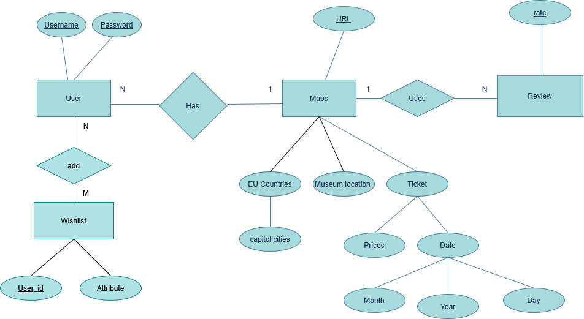
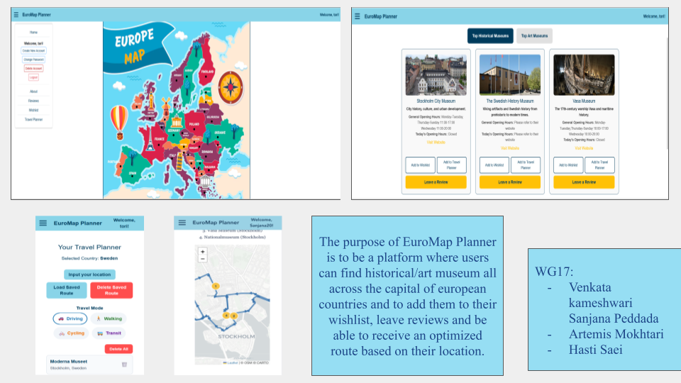

# Backend and Frontend Template

## Google Maps API Key

This project uses the Google Maps API. For security, the key has been removed from the repository. 
To run the project locally, create a `.env` file in the root folder and add:

GOOGLE_MAPS_API_KEY=YOUR_KEY_HERE


---

## Project Structure

| File | Purpose | Notes |
|------|---------|-------|
| `server/` | Backend server code | All your server logic |
| [server/README.md](server/README.md) | Backend instructions | **READ ME carefully!** |
| `client/` | Frontend client code | All UI code |
| [client/README.md](client/README.md) | Frontend instructions | **READ ME carefully!** |
| [docs/LOCAL_DEPLOYMENT.md](docs/LOCAL_DEPLOYMENT.md) | Local production deployment | Steps to deploy locally in production mode |

---

## Requirements

- [Git](https://git-scm.com/) (tested with v2)  
  - Set your username & email:
    ```bash
    git config --global user.name "YOUR_USERNAME"
    git config --global user.email "email@example.com"
    ```
  - Windows: use [Git Bash](https://www.atlassian.com/git/tutorials/git-bash) or WSL  
- [Chalmers GitLab](https://git.chalmers.se/) (login with Chalmers CID)  
  - DIT342 course group: https://git.chalmers.se/courses/dit342  
  - SSH setup: [GitLab SSH Keys](https://docs.gitlab.com/user/ssh/#generate-an-ssh-key-pair)

- Server Requirements: see [server README](./server/README.md#Requirements)  
- Client Requirements: see [client README](./client/README.md#Requirements)  

---

## Getting Started

```bash
# Clone repository
git clone git@git.chalmers.se:courses/dit342/group-00-web.git
cd group-00-web

# Setup backend
cd server && npm install
npm run dev

# Setup frontend
cd client && npm install
npm run serve

## Visual Studio Code (VSCode)

Open the `server` and `client` in separate VSCode workspaces or open the combined [backend-frontend.code-workspace](./backend-frontend.code-workspace). Otherwise, workspace-specific settings don't work properly.
```
## System Definition (MS0)

### Purpose

The purpose of the system is to allow the users to search for different art/historical museums in the capital of an EU country
of their choice. This will help the user in viewing different museums in the capitals during their travel since all the
necessary information related to the museum will also be displayed to the user. The user can select specific museums and add them to their wishlist after creating and logging in to their accounts. The user can update/view thier wishlist after logging in. The user can also leave reviews about any of the musems (which will be displayed to other users) and rate the website out of five stars.


### Advanced Features: Intelligent Travel Planner
- Select museums to visit on a particular day.
- Input user location; system calculates estimated travel time & distance.
- Choose travel mode: walking, car, or bus.
- Generate an optimized travel plan based on opening hours and traffic.
- Save travel plans to user account.


### The advance feature workflow will be: 
The user can select museum(s) that they want to visit on a particular day. 
Based on the user’s location (user will input this info) and the museums, the system will give the user an estimated travel time and the total travel distance.
The user can then select a travel mode (ie walking, car, bus).
Based on this travel mode, and the opening/closing hours of the selected museums and the traffic on the specific date and time - an optimised travel plan is presented to the user.
The user can also save a travel plan in their accounts.


### Backend Enhancement:
Integration of routes and distance calculation API’s.
Also processes opening/closing time of museums and aligns them according to the user’s availability.
Users can now pick a travel mode.
Users can store their travel plan and retrieve it.
New algorithm layer is implemented ( to calculate the optimised travel plan of the user)

### Frontend Enhancement:
Interactive museum trip planner UI - the user can select museums, select travel mode, save their travel plan, choose a date and a travel plan is generated.
Real-time travel mode selection - The user can re-select their travel mode at any location.
A new section in the UI is shown to display the user’s saved travel plans.


### Pages
- Map of Europe: clickable countries.
- Country selection → choose art or historical museums.
- Bookmark museums → added to wishlist (requires login).
- Create/login account to view wishlist.


### Entity-Relationship (ER) Diagram



## Teaser (MS3)


